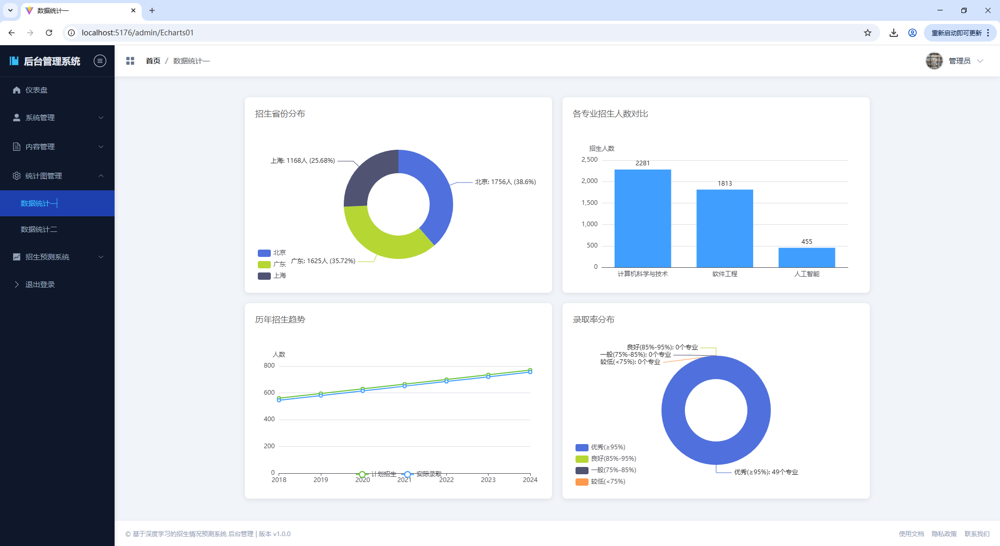
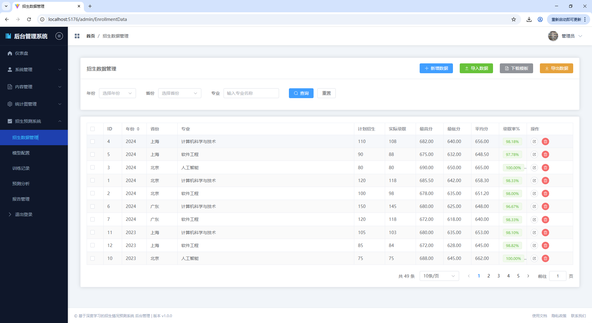
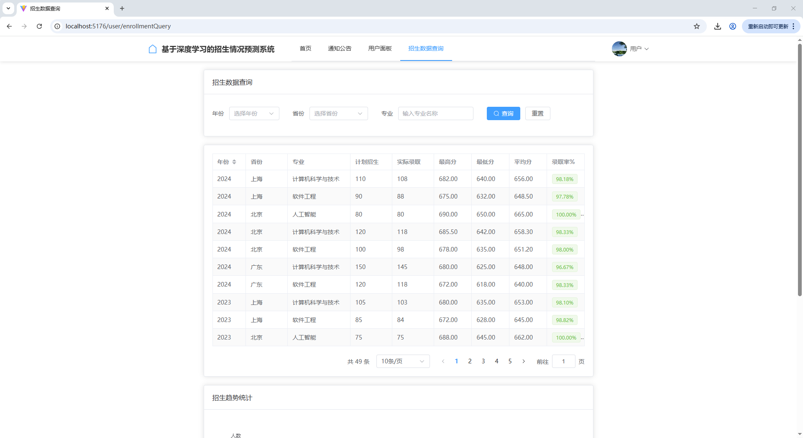
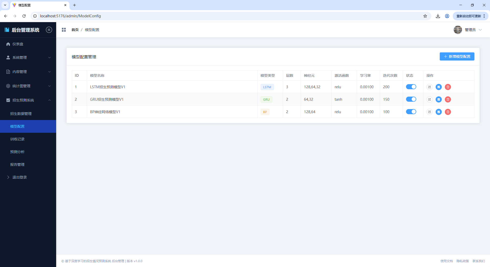
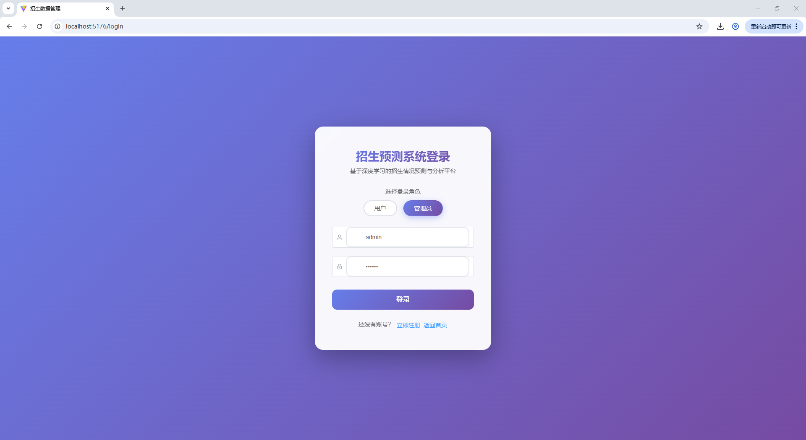
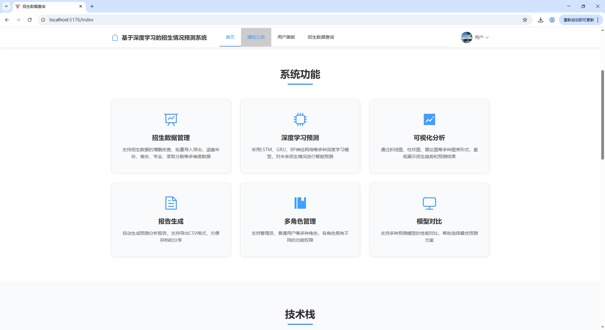
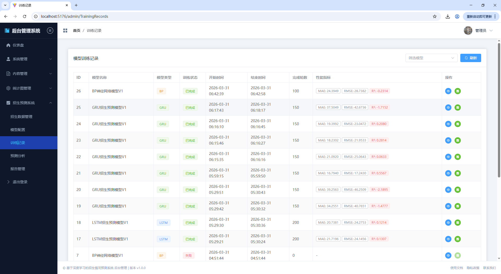
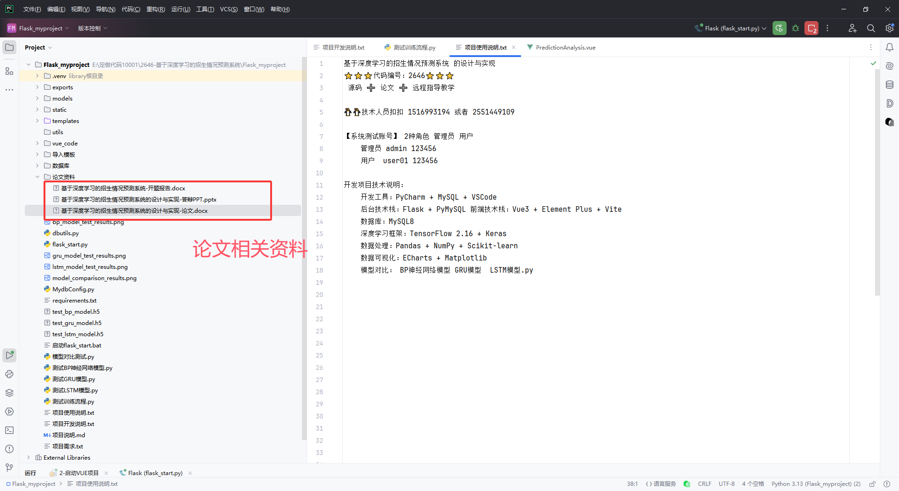
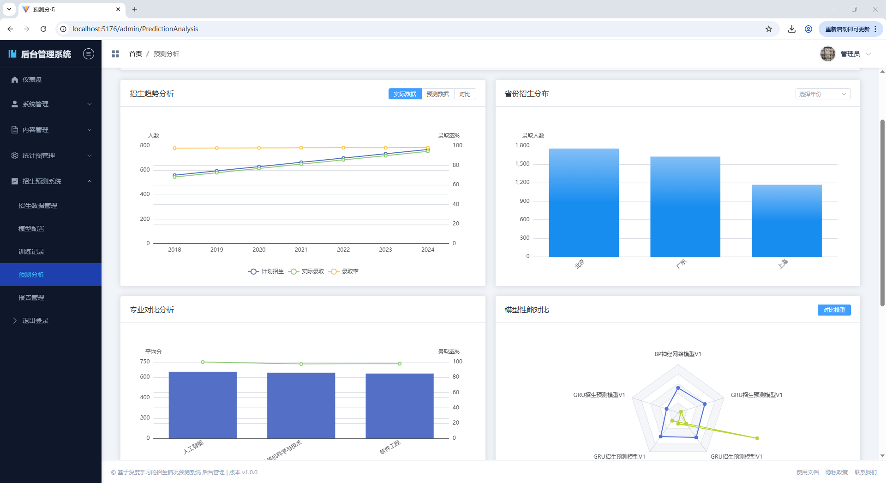
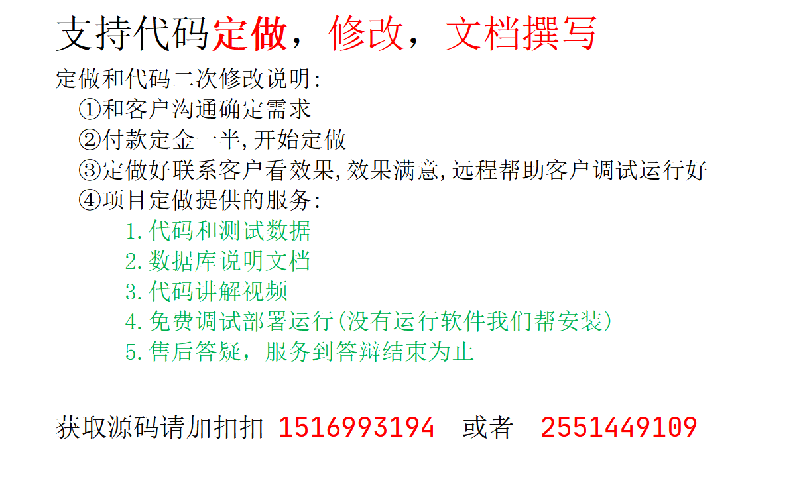

# 基于深度学习的招生情况预测系统
## 代码编号  2646 

## B站演示视频地址 
## https://www.bilibili.com/video/BV1QiD5BQEaX/


================================================================================

一、用户管理功能

- 用户注册：新用户可以通过注册页面创建账号
- 用户登录：支持用户名密码登录，根据角色自动跳转对应首页
- 角色权限控制：区分管理员和普通用户两种角色
- 用户信息管理：查看和修改个人资料
- 用户列表管理（管理员）：对用户进行增删改查、状态管理


================================================================================

二、招生数据管理功能

- 数据增删改查：对招生数据（年份、省份、专业、计划数、录取数、分数等）进行CRUD操作
- 数据导入：支持CSV/Excel格式批量导入招生数据
- 数据导出：将招生数据导出为CSV文件
- 数据查询：支持按年份、省份、专业等多条件筛选查询
- 数据统计：提供招生数据的统计分析功能


================================================================================

三、深度学习模型功能

- 模型配置：设置神经网络结构（层数、神经元数量、激活函数）
- 训练参数设置：配置学习率、迭代次数、批次大小等参数
- 模型训练：启动模型训练过程，支持LSTM、GRU、BP等多种神经网络
- 训练记录：保存和查看模型训练历史、性能指标
- 模型保存：自动保存训练好的模型文件


================================================================================

四、预测分析功能

- 招生预测：使用训练好的模型对未来招生情况进行预测
- 结果可视化：以折线图、柱状图等形式展示预测结果
- 历史对比：将预测结果与历史真实数据进行对比展示
- 模型对比：对比不同模型的预测精度差异


================================================================================

五、报告管理功能

- 报告生成：生成包含图表、数据表格、结论摘要的预测分析报告
- 报告查看：在线预览生成的分析报告
- 报告导出：支持将报告导出为CSV文件
- 报告下载：下载历史生成的报告


================================================================================

六、系统管理功能

- 通知公告：发布、编辑、删除系统公告
- 轮播图管理：上传、管理首页轮播图片
- 仪表盘展示：展示系统统计概览和数据可视化图表
- 数据可视化：通过ECharts展示招生数据分析和预测结果对比


================================================================================

七、前台展示功能

- 系统首页：展示轮播图、系统简介、快捷入口
- 招生数据查询：普通用户可按条件查询招生数据
- 通知公告查看：浏览系统发布的公告信息
- 个人中心：管理个人信息


================================================================================


## 部分功能实现截图
============================================================










## 一、测试账号信息

| 角色 | 用户名 | 密码 | 权限 |
|------|--------|------|------|
| 管理员 | admin | 123456 | 全部功能 |
| 普通用户 | test | 123456 | 前台功能 |

---

## 二、技术栈说明

### 2.1 后端技术栈

| 技术 | 版本 | 说明 |
|------|------|------|
| Python | 3.13+ | 后端开发语言 |
| Flask | 3.0.3 | Web应用框架，提供RESTful API接口 |
| Flask-CORS | 4.0.1 | 跨域资源共享支持 |
| PyMySQL | 1.1.1 | MySQL数据库连接驱动 |
| MySQL | 8.x | 关系型数据库 |

### 2.2 深度学习技术栈

| 技术 | 版本 | 说明 |
|------|------|------|
| TensorFlow | 2.16.1 | 深度学习框架，内置Keras API |
| NumPy | 1.26.4 | 数值计算库 |
| Pandas | 2.2.2 | 数据分析和处理 |
| Scikit-learn | 1.5.1 | 机器学习工具包（数据预处理、模型评估） |
| Matplotlib | 3.9.1 | 数据可视化绘图 |
| OpenPyXL | 3.1.5 | Excel文件读写支持 |

### 2.3 前端技术栈

| 技术 | 版本 | 说明 |
|------|------|------|
| Vue | 3.5.24 | 前端渐进式JavaScript框架 |
| Vue Router | 4.6.3 | 前端路由管理 |
| Pinia | 3.0.4 | 状态管理库 |
| Element Plus | 2.11.7 | UI组件库 |
| Vite | 7.2.2 | 前端构建工具 |
| ECharts | 6.0.0 | 数据可视化图表库 |
| Axios | 1.13.2 | HTTP请求库 |

---

## 三、项目目录结构

```
Flask_myproject/                          # 项目根目录
│
├── flask_start.py                        # Flask后端主程序（核心入口）
├── dbutils.py                            # MySQL数据库工具类
├── MydbConfig.py                         # 数据库配置信息
├── requirements.txt                      # Python依赖库清单
│
├── models/                               # 训练好的模型文件存储目录
│   ├── model_xxx.keras                   # Keras格式模型文件
│   └── model_xxx.h5                      # HDF5格式模型文件（旧版）
│
├── exports/                              # 数据导出文件存储目录
├── static/uploads/                       # 图片上传存储目录
│
├── templates/                            # Flask模板文件
│   └── index.html                        # 首页模板
│
├── utils/                                # 工具类目录
│
├── 数据库/                               # 数据库相关文件
│   └── 数据库设计.sql                     # 数据库结构及测试数据
│
├── 导入模板/                             # 数据导入模板
│   └── 招生数据导入模板.csv                # CSV导入模板文件
│
└── vue_code/                             # 前端Vue项目目录
    ├── package.json                      # 前端依赖配置
    ├── vite.config.js                    # Vite构建配置
    ├── index.html                        # 入口HTML文件
    │
    ├── src/
    │   ├── main.js                       # Vue应用入口
    │   ├── App.vue                       # 根组件
    │   ├── style.css                     # 全局样式
    │   │
    │   ├── router/
    │   │   └── index.js                  # 路由配置
    │   │
    │   ├── utils/
    │   │   └── request.js                # Axios请求封装
    │   │
    │   ├── views/                        # 页面视图组件
    │   │   ├── Login.vue                 # 登录页面
    │   │   ├── Register.vue              # 注册页面
    │   │   ├── NotFound.vue              # 404页面
    │   │   │
    │   │   ├── home/                     # 用户前台页面
    │   │   │   ├── UserLayout.vue        # 用户布局组件
    │   │   │   ├── Index.vue             # 首页
    │   │   │   ├── Dashboard.vue         # 用户仪表盘
    │   │   │   ├── UserCenter.vue        # 个人中心
    │   │   │   ├── EnrollmentQuery.vue   # 招生数据查询
    │   │   │   ├── IndexNotice.vue       # 通知公告页
    │   │   │   ├── MyCarousel.vue        # 轮播图组件
    │   │   │   ├── MyHead.vue            # 头部导航组件
    │   │   │   ├── MyFoot.vue            # 底部组件
    │   │   │   └── MyFavorite.vue        # 收藏/快捷入口
    │   │   │
    │   │   └── manage/                   # 管理员后台页面
    │   │       ├── AdminLayout.vue       # 管理员布局组件
    │   │       ├── SidebarMenu.vue       # 侧边栏菜单
    │   │       ├── Dashboard.vue         # 管理仪表盘
    │   │       ├── AdminCenter.vue       # 管理员个人中心
    │   │       ├── ListUserinfo.vue      # 用户管理
    │   │       ├── ListNoticeinfo.vue    # 通知管理
    │   │       ├── ListCarousel.vue      # 轮播图管理
    │   │       ├── EnrollmentData.vue    # 招生数据管理
    │   │       ├── ModelConfig.vue       # 模型配置
    │   │       ├── TrainingRecords.vue   # 训练记录
    │   │       ├── PredictionAnalysis.vue# 预测分析
    │   │       ├── ReportManage.vue      # 报告管理
    │   │       ├── Echarts01.vue         # 数据统计图表1
    │   │       └── Echarts02.vue         # 数据统计图表2
    │   │
    │   ├── components/                   # 公共组件
    │   │   └── HelloWorld.vue
    │   │
    │   └── assets/                       # 静态资源
    │       └── vue.svg
    │
    └── public/                           # 公共资源
        ├── vite.svg
        └── bg-2.jpg
```

---

## 四、数据库表结构说明

| 表名 | 功能说明 |
|------|----------|
| userinfo | 用户信息表（登录账号、角色、个人信息） |
| enrollment_data | 招生数据表（年份、省份、专业、录取数据等） |
| model_config | 模型配置表（神经网络结构、训练参数配置） |
| training_record | 训练记录表（训练过程、性能指标、模型文件路径） |
| prediction_result | 预测结果表（预测值、实际值、置信区间） |
| report_record | 报告记录表（生成的分析报告） |
| system_config | 系统配置表（系统参数设置） |
| notice | 通知公告表（系统公告信息） |
| carousel | 轮播图表（首页轮播图片） |

---

## 五、后端接口说明

### 5.1 基础接口

| 接口 | 方法 | 功能 |
|------|------|------|
| /updateAction | POST | 通用数据操作（增删改） |
| /selectPageAction | GET/POST | 分页查询接口 |
| /selectAction | GET/POST | 普通查询接口 |
| /uploadFile | POST | 文件上传接口 |

### 5.2 用户认证接口

| 接口 | 方法 | 功能 |
|------|------|------|
| /api/login | POST | 用户登录 |
| /api/register | POST | 用户注册 |

### 5.3 用户管理接口（管理员）

| 接口 | 方法 | 功能 |
|------|------|------|
| /api/user/list | GET/POST | 获取用户列表（分页+搜索） |
| /api/user/detail | GET | 获取用户详情 |
| /api/user/add | POST | 添加用户 |
| /api/user/update | POST | 更新用户信息 |
| /api/user/delete | POST | 删除用户 |

### 5.4 通知管理接口（管理员）

| 接口 | 方法 | 功能 |
|------|------|------|
| /api/notice/list | GET/POST | 获取通知列表 |
| /api/notice/detail | GET | 获取通知详情 |
| /api/notice/add | POST | 添加通知 |
| /api/notice/update | POST | 更新通知 |
| /api/notice/delete | POST | 删除通知 |

### 5.5 轮播图管理接口（管理员）

| 接口 | 方法 | 功能 |
|------|------|------|
| /api/carousel/list | GET/POST | 获取轮播图列表 |
| /api/carousel/detail | GET | 获取轮播图详情 |
| /api/carousel/add | POST | 添加轮播图 |
| /api/carousel/update | POST | 更新轮播图 |
| /api/carousel/delete | POST | 删除轮播图 |

### 5.6 招生数据管理接口

| 接口 | 方法 | 功能 |
|------|------|------|
| /api/enrollment/list | GET/POST | 获取招生数据列表 |
| /api/enrollment/add | POST | 添加招生数据 |
| /api/enrollment/update | POST | 更新招生数据 |
| /api/enrollment/delete | POST | 删除招生数据 |
| /api/enrollment/import | POST | 导入招生数据（CSV/Excel） |
| /api/enrollment/export | GET | 导出招生数据 |
| /api/enrollment/statistics | GET | 获取招生数据统计 |

### 5.7 模型管理接口

| 接口 | 方法 | 功能 |
|------|------|------|
| /api/model/list | GET | 获取模型配置列表 |
| /api/model/detail | GET | 获取模型详情 |
| /api/model/add | POST | 添加模型配置 |
| /api/model/update | POST | 更新模型配置 |
| /api/model/delete | POST | 删除模型配置 |

---

## 六、前端页面功能说明

### 6.1 公共页面

| 文件名 | 功能说明 |
|--------|----------|
| Login.vue | 登录页面，支持用户名密码登录，自动跳转角色首页 |
| Register.vue | 注册页面，新用户注册，包含表单验证 |
| NotFound.vue | 404错误页面，路径不存在时显示 |

### 6.2 用户前台页面（home/目录）

| 文件名 | 功能说明 |
|--------|----------|
| UserLayout.vue | 用户端布局组件，包含头部导航和底部信息 |
| Index.vue | 系统首页，展示轮播图、系统简介、快捷入口 |
| Dashboard.vue | 用户个人面板，展示个人数据统计、快捷操作 |
| UserCenter.vue | 个人中心，查看和修改个人信息 |
| EnrollmentQuery.vue | 招生数据查询，支持按年份、省份、专业筛选 |
| IndexNotice.vue | 通知公告页，展示系统公告列表 |
| MyCarousel.vue | 轮播图组件，首页图片轮播展示 |
| MyHead.vue | 头部导航组件，包含Logo、菜单、用户信息 |
| MyFoot.vue | 底部组件，版权信息等 |
| MyFavorite.vue | 快捷入口/收藏组件 |

### 6.3 管理员后台页面（manage/目录）

| 文件名 | 功能说明 |
|--------|----------|
| AdminLayout.vue | 管理端布局组件，包含侧边栏和顶部导航 |
| SidebarMenu.vue | 侧边栏菜单组件，动态生成导航菜单 |
| Dashboard.vue | 管理仪表盘，展示系统统计概览、数据可视化 |
| AdminCenter.vue | 管理员个人中心，修改个人信息 |
| ListUserinfo.vue | 用户管理，用户的增删改查、状态管理 |
| ListNoticeinfo.vue | 通知管理，系统公告的发布、编辑、删除 |
| ListCarousel.vue | 轮播图管理，首页轮播图片的上传、排序 |
| EnrollmentData.vue | 招生数据管理，数据CRUD、导入导出功能 |
| ModelConfig.vue | 模型配置，神经网络结构配置、训练参数设置 |
| TrainingRecords.vue | 训练记录，查看模型训练历史、性能指标 |
| PredictionAnalysis.vue | 预测分析，使用训练好的模型进行预测、可视化 |
| ReportManage.vue | 报告管理，生成和导出预测分析报告 |
| Echarts01.vue | 数据统计图表1，招生数据可视化分析 |
| Echarts02.vue | 数据统计图表2，预测结果对比分析 |

---

## 七、核心功能模块说明

### 7.1 数据管理模块

- **功能**：招生数据的增删改查、批量导入导出
- **涉及文件**：EnrollmentData.vue、flask_start.py（enrollment相关接口）
- **支持格式**：CSV/Excel格式导入，数据导出为CSV

### 7.2 模型构建与训练模块

- **功能**：神经网络模型配置、训练、保存
- **涉及文件**：ModelConfig.vue、TrainingRecords.vue
- **支持模型**：LSTM、GRU、BP等多种神经网络结构
- **可配置参数**：层数、神经元数量、激活函数、学习率、迭代次数等

### 7.3 预测分析与可视化模块

- **功能**：使用训练好的模型进行预测，结果可视化
- **涉及文件**：PredictionAnalysis.vue、Echarts01.vue、Echarts02.vue
- **图表类型**：折线图、柱状图、对比图等

### 7.4 结果报告模块

- **功能**：生成预测分析报告，支持导出
- **涉及文件**：ReportManage.vue
- **导出格式**：支持打印、CSV导出

---

## 八、启动说明

### 8.1 后端启动

1. 安装Python依赖：`pip install -r requirements.txt`
2. 配置数据库：在MydbConfig.py中设置数据库连接信息
3. 导入数据库：执行 `数据库/数据库设计.sql`
4. 启动服务：双击运行 `启动flask_start.bat`
5. 访问地址：http://localhost:5000

### 8.2 前端启动

1. 进入vue_code目录：`cd vue_code`
2. 安装依赖：`npm install` 或 `yarn install`
3. 启动开发服务器：`npm run dev`
4. 访问地址：http://localhost:5173

---

## 九、注意事项

1. **数据库配置**：请先在MydbConfig.py中配置正确的数据库连接信息
2. **TensorFlow**：首次运行可能需要下载模型，请保持网络畅通
3. **文件上传**：确保static/uploads目录有写入权限
4. **模型文件**：训练好的模型保存在models目录下
5. **跨域问题**：开发环境已配置CORS，生产环境需配置Nginx反向代理
# 代码获取

